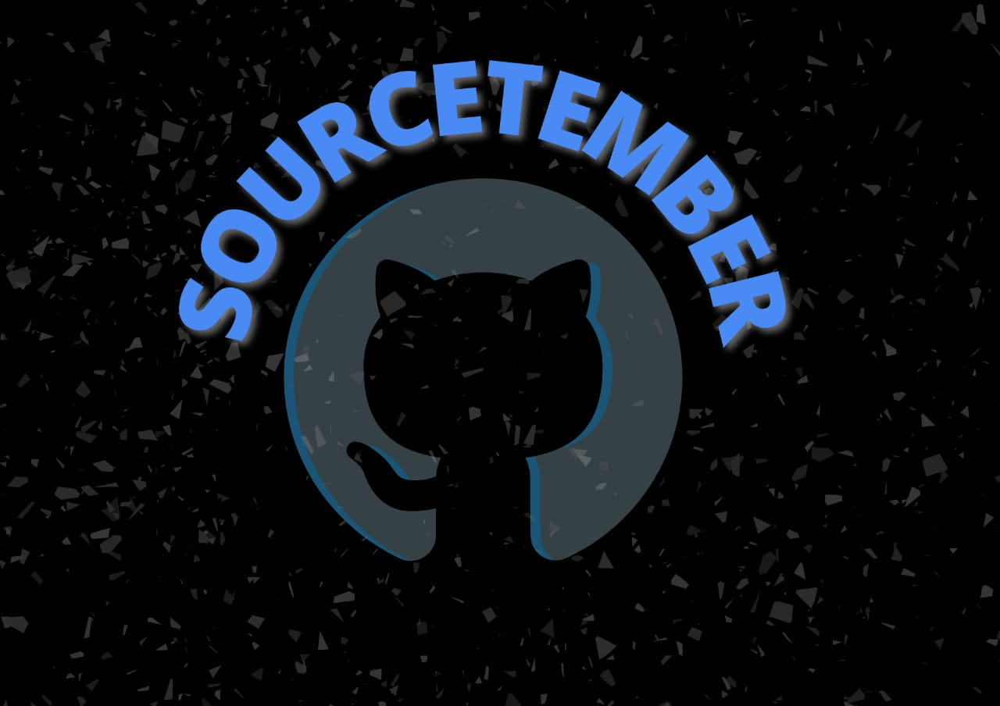

# *_SourceTember_* #
### *A way towards open-source 💻* ###
<br>


# What is SourceTember? #
It is a 3 days series event celebration from  29-09-2021 to 01-10-2021 organised by Google Developer Student Clubs -DCE  to get people involved in Open Source. Create your very first pull request  to our repository on GitHub.

<br>

# What is Hacktoberfest? #
A month-long celebration from October 1st - 31st sponsored by Digital Ocean and GitHub to get people involved in Open Source. Create your very first pull request to any public repository on GitHub and contribute to the open source developer community.

# Note:  #
### This repo is to welcome beginners to GitHub and the Opensource community by helping them learn how to make their PR and contribution. ###

### Those who are interested to be a part of Hacktoberfest are also to be welcomed at Sourcetember to learn and to extend their PR. 
### So, impart yourself in a way  that you can justify this platform. ###
<br>


# About the PROJECT #

None of us can deny the fact that we, the Gen-Z, got to know DC before Marvel ( A die-hard DC fan talking lol). I mean come on, it was just like a clone of DC for many years until it came out as The Marvel Universe which all of us are crazy about. 

Nobody can deny the fact that how much these superheroes comically give their lives to save Americans, we can never get enough of it!
(Tell me how many tears you shed after endgame and I'll tell mine.)
Blackwidow as the coolest feminine figure, Iron Man and his fatherly love towards Spidy, Captain's abs, not gonna leave Deadpool behind and our handsomest Hulk;
how perfectly these Avengers become our escape from reality that we all need. 

Keeping all that in our dearest minds let's create a clone website similar to Marvel's with your very creative minds using Open Source libraries with the instructions provided. 

Let's go and make Stan Lee proud!!!


# What you will be doing? #

Use this project to make your first contribution to an open source project on GitHub. Practice making your first pull request to a public repository before doing the real thing!
This repository is open to all members of the GitHub community. Any member may contribute to this project without being a collaborator.


# How to contribute to this project #
You can add cards for any of these pages:

 > Movies

 > Series

 > Comics
 
 > Characters


## Here are some quick and painless ways to contribute to this project: ##

Getting started  

``` 
Fork this repository (Click the Fork button in the top right of this page, click your Profile Image)
 ``` 

Clone your fork down to your local machine
```
 git clone https://github.com/Dsc-Dce/Marvel-web-app.git
```

Create a branch 
```
 git checkout -b branch-name
 ```

 Make your changes (choose from any task below) 

```
 git add . 

 ```
``` 
git commit -m 'Commit message' 
```
Adding your details in #Contributors.md

Add the following line of code and update link and name by yours.

```
<a href="<LINK TO YOUR GITHUB USERNAME>">YOUR NAME</a>
```
```
 git add Contributors.md 
 
 ```
``` 
git commit -m 'added details in Contributors.md' 
```

``` 
git push origin branch-name 
```

 Create a new pull request from your forked repository (Click the New Pull Request button located at the top of your repo)
 [Please note that the title of PR is Specified below]
 

Wait for your PR review and merge approval!


Star this repository if you had fun!


# Title of Pull Request #

Added _______ card in _______ section

(For example : Added Endgames in movies section)
